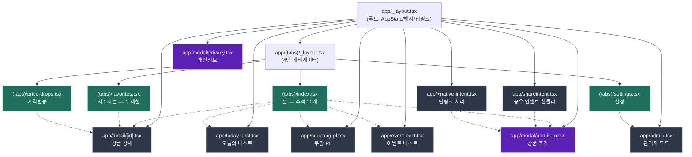
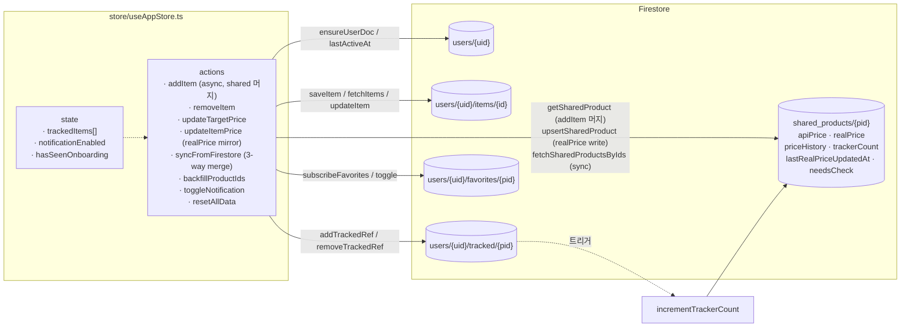
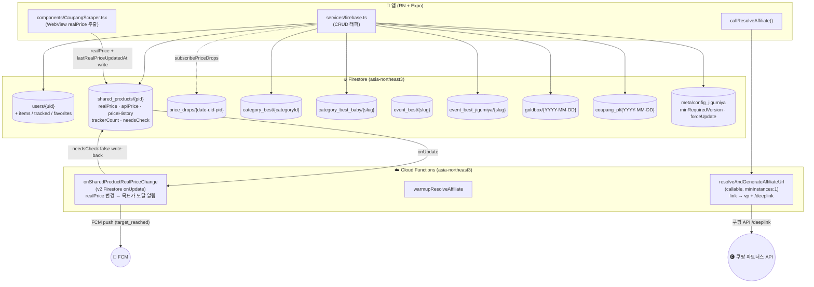
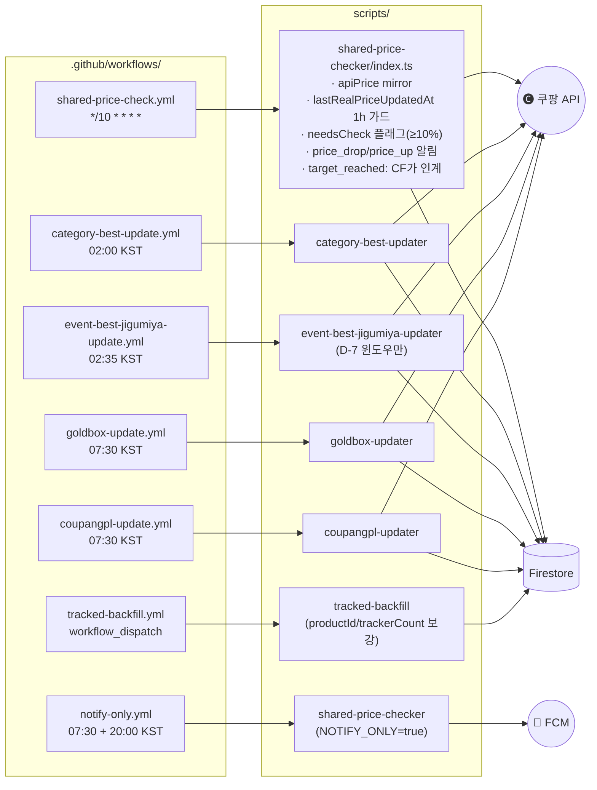
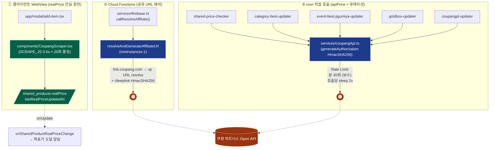
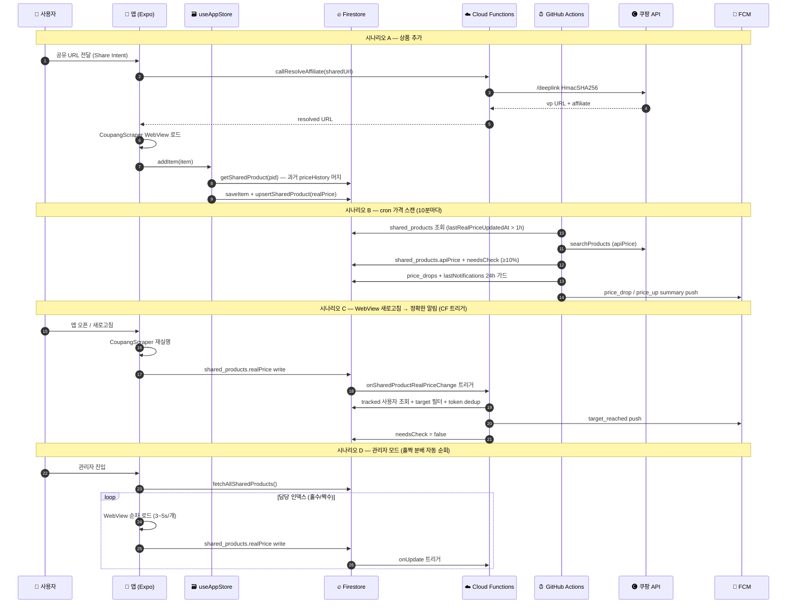

# 024. 앱 전체 아키텍처 다이어그램 (1.0.16 기준)

> **작성일**: 2026-05-11
> **버전**: 1.0.16 (bn51/vc51) — RealPrice 아키텍처(docs/023) 도입 완료 상태 반영
> **범위**: 프론트엔드(Expo Router) · 상태관리(Zustand) · Firebase(Firestore + CF) · cron(GitHub Actions) · 쿠팡 파트너스 API

---

## 1. 프론트엔드 — Expo Router 화면 구조



---

## 2. 상태관리 — Zustand `useAppStore` ↔ Firestore



---

## 3. Firebase — Firestore 컬렉션 + Cloud Functions



---

## 4. cron — GitHub Actions 타임라인 (KST)

```mermaid
gantt
  title GitHub Actions cron 스케줄 (KST 기준 / 1.0.16)
  dateFormat HH:mm
  axisFormat %H:%M

  section 가격 스캔
  shared-price-check (*/10 + 04:30~01:00 가드)   :active, p1, 00:00, 24h

  section 카테고리/이벤트
  category-best (02:00)             :crit, c1, 02:00, 30m
  event-best-jigumiya (02:35)       :crit, e1, 02:35, 20m

  section 골드박스/PL
  goldbox-updater (07:30)           :g1, 07:30, 10m
  coupangpl-updater (07:30)         :g2, 07:30, 10m

  section 알림 전용
  notify-only (morning 07:30)       :milestone, n1, 07:30, 0m
  notify-only (evening 20:00)       :milestone, n2, 20:00, 0m
```



---

## 5. 쿠팡 파트너스 API 흐름 — 3개 진입점



---

## 6. 통합 데이터 흐름 — RealPrice 아키텍처 (1.0.16)



---

## 7. 핵심 노트

### 알림 발송 책임 (1.0.16 분리)
| 알림 유형 | 발송 주체 | 트리거 |
|---------|---------|--------|
| `price_drop_summary` | cron (shared-price-checker) | apiPrice 하락 감지 |
| `price_up_summary` | cron (shared-price-checker) | apiPrice 상승 감지 |
| `target_reached` | **Cloud Functions** (`onSharedProductRealPriceChange`) | realPrice ≤ targetPrice |
| 골드박스 / 이벤트 유도 | cron (notify-only) | 07:30 / 20:00 정시 |

> cron 측 `target_reached` 발송 코드는 주석 처리 상태 — 1.0.16 베타 검증 후 정식 삭제 예정.

### 진실 원천 (Source of Truth)
- **realPrice**: 앱 WebView 만 write — 알림/그래프 기준
- **apiPrice**: cron 만 write — 참고용 (변동 감지 시 needsCheck 플래그만)
- **priceHistory**: realPrice 기준으로만 누적 (`{ date, realPrice }`)

### Rate Limit 준수
- 쿠팡 파트너스 공식: 검색 1분/50회, 전체 합산 1분/100회
- cron 보수 설정: 호출당 sleep 2s, 분당 최대 30회
- rate-limited 응답 시 즉시 중단 (재시도 없음)

---

## 참조
- [docs/023_RealPrice_Architecture.md](./023_RealPrice_Architecture.md) — apiPrice/realPrice 분리 아키텍처
- [docs/017_앱구조개편_Phase3.md](./017_앱구조개편_Phase3.md) — 4탭 + shared_products 도입
- [docs/018_FirebaseFunctions_Resolver.md](./018_FirebaseFunctions_Resolver.md) — resolveAndGenerateAffiliateUrl 설계
- [docs/020_PriceChecker_CronDesign.md](./020_PriceChecker_CronDesign.md) — cron 매트릭스 설계
